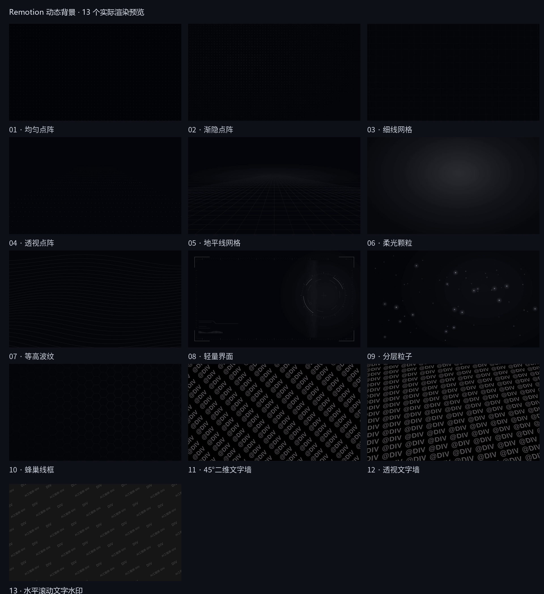
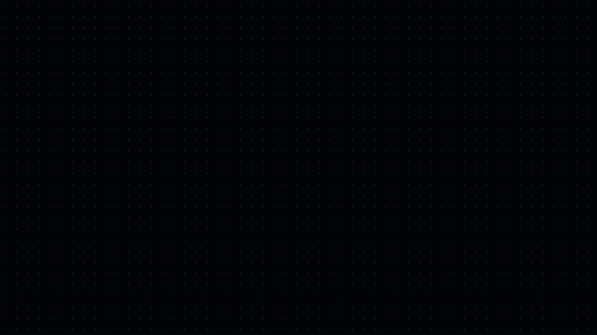
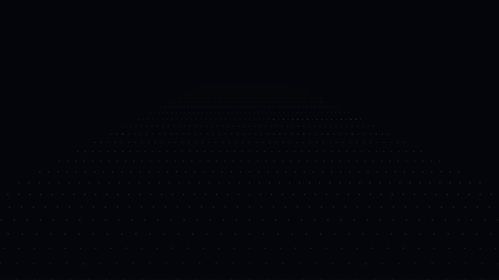
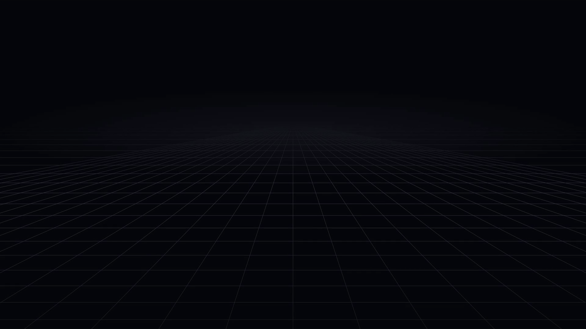
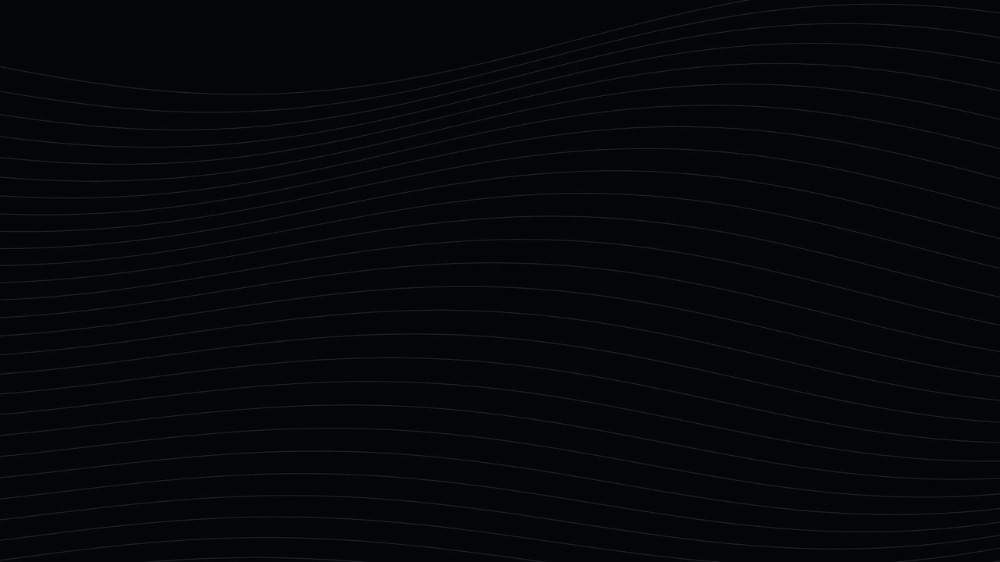
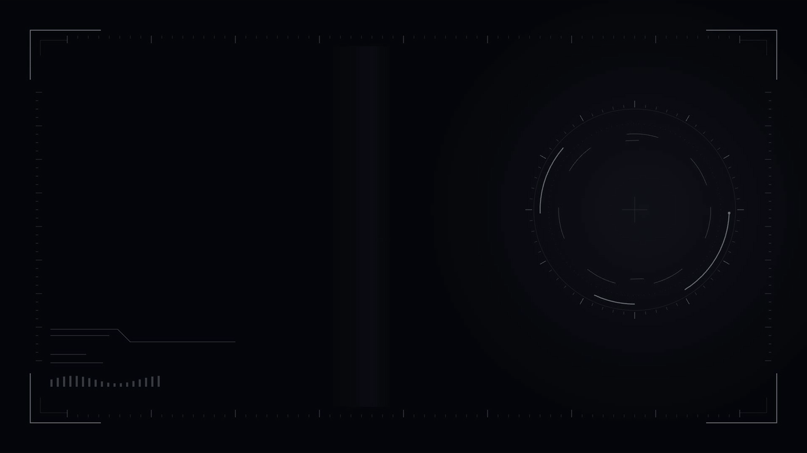
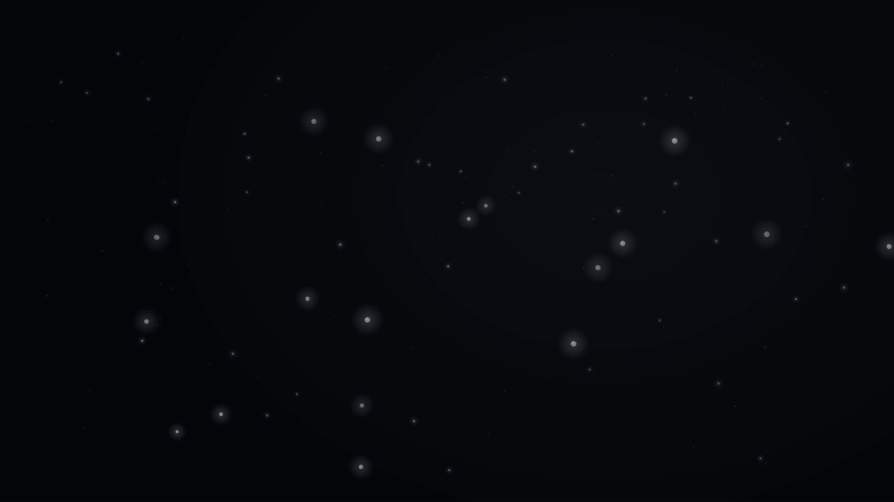
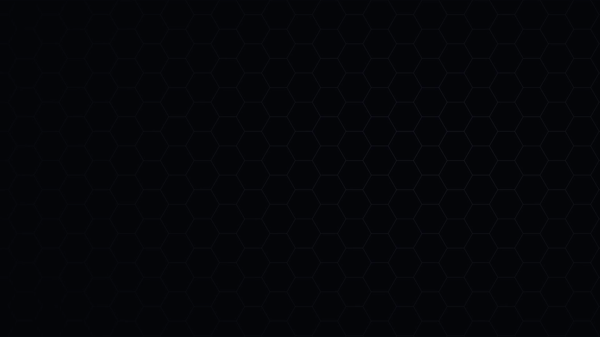
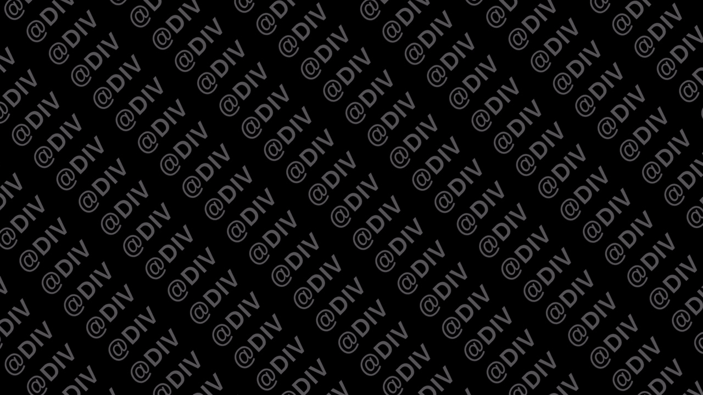
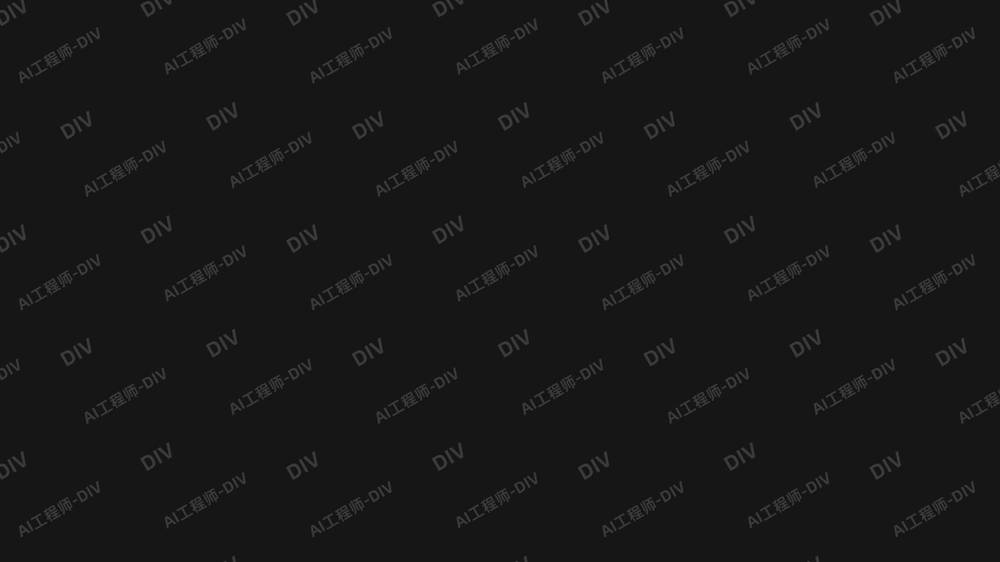

# remotion-background-templates

13 个可复用的 Remotion 动态背景模板

为 AI 教程、口播、录屏和知识讲解制作的低调动态背景。所有画面由 React + SVG / CSS 程序化生成，不依赖图库、音乐或外部视频。

- 1920 × 1080 · 30 fps · 前 12 款每段 6 秒，第 13 款 12 秒 · 无音轨
- 十三个独立 Composition 与可配置 React 组件
- 帧驱动、确定性动画；默认参数支持循环
- 下方 GIF 为实际 Remotion 渲染视频的 1280 × 720 / 12 fps 预览

## 预览



点击每款标题展开高清 GIF。

<details>
<summary>01 · 均匀点阵</summary>

黑底灰白圆点，慢速纵向流动。Composition ID：`UniformDots`



</details>

<details>
<summary>02 · 渐隐点阵</summary>

渐变遮罩与轻微游移，留出文字空间。Composition ID：`FadingDots`


</details>

<details>
<summary>03 · 细线网格</summary>

弱对比细方格，适合录屏与代码演示。Composition ID：`ThinGrid`


</details>

<details>
<summary>04 · 透视点阵</summary>

向地平线收敛的点阵，当前双倍速度。Composition ID：`PerspectiveDots`



</details>

<details>
<summary>05 · 地平线网格</summary>

透视地面与清爽上半区，当前双倍速度。Composition ID：`HorizonGrid`



</details>

<details>
<summary>06 · 柔光颗粒</summary>

柔和径向光晕与静态细噪声。Composition ID：`RadialNoise`


</details>

<details>
<summary>07 · 等高波纹</summary>

低对比连续曲线，柔和周期变化。Composition ID：`ContourWaves`



</details>

<details>
<summary>08 · 轻量界面</summary>

克制的框线、刻度与扫描层。Composition ID：`QuietHud`



</details>

<details>
<summary>09 · 分层粒子</summary>

多层光点与不同幅度的缓慢漂移。Composition ID：`DriftingParticles`



</details>

<details>
<summary>10 · 蜂巢线框</summary>

低对比几何网格与轻微呼吸。Composition ID：`Honeycomb`



</details>

<details>
<summary>11 · 45°二维文字墙</summary>

向右上倾斜45°、列对齐、按本地纵轴滚动。Composition ID：`ScrollingHandles`



</details>

<details>
<summary>12 · 透视文字墙</summary>

上小下大的参考透视、明亮中性灰、加速滚动。Composition ID：`ScrollingHandles3D`


</details>

<details>
<summary>13 · 水平滚动文字水印</summary>

近黑底、深灰粗体的 `DIV` 与 `AI工程师-DIV` 稀疏错位排列；每个标签倾斜 −30°，整体仅沿屏幕 X 轴匀速向左滚动。12 秒无声循环，不含发光、3D 或前景内容。Composition ID：`HorizontalWatermarks`



</details>

## 本地使用

需要 Node.js 20+。

```bash
npm ci
npm start
```

批量渲染：

```bash
npm run render
```

单独渲染并调整属性：

```bash
npx remotion render src/index.ts ScrollingHandles output/handles.mp4 --props='{"text":"@DIV","speed":1,"intensity":1}'
```

单独渲染第 13 款水平文字水印（1080p、30fps、12 秒）：

```bash
npx remotion render src/index.ts HorizontalWatermarks output/13-HorizontalWatermarks.mp4
```

也可运行 `node scripts/render-watermarks.mjs`，生成视频和多时间点静帧。需要本机验收时，运行 `python scripts/qa-watermarks.py`（依赖 Pillow、NumPy，以及 ffmpeg / ffprobe）。

首次渲染会使用 / 下载 Remotion 官方 Chrome Headless Shell。也可通过 `REMOTION_BROWSER_EXECUTABLE` 指定兼容浏览器。

## 参数

- `background`：底色
- `color`：图案 / 文字颜色
- `intensity`：强度 0–1
- `speed`：相对速度，0 为静止；整数速度保持完整周期
- `seed`：粒子与噪声种子
- 第 11 / 12 款文字墙附加 `text`、`fontSize`、`tilt`、`rowGap`
- 第 13 款标签文字、字号与 −30° 倾角固定为参考设计；支持 `background`、`color`、`intensity`、`speed`。默认 12 秒水平移动 560px，约 46.67px/s；整数 `speed` 保持无缝循环

默认 11 号的基线为 −45°，每 6 秒滚动 4 行；12 号 X 轴透视为 32°、基线 −10°，每 6 秒滚动 8 行。文字以中性灰呈现，列不交错。参考截图只用于观察风格，不在成片或项目中分发。

## 组件复用

```tsx
import {AbsoluteFill} from 'remotion';
import {FadingDots} from './src/Backgrounds';

export const MyVideo = () => (
  <AbsoluteFill>
    <FadingDots intensity={0.65} speed={1} />
    <AbsoluteFill>{/* 添加人物、录屏、标题或字幕 */}</AbsoluteFill>
  </AbsoluteFill>
);
```

修改尺寸、时长与帧率：`src/Root.tsx`。推荐维持 16:9；不同宽高比尚未逐项视觉验收。

## 验证

```bash
npm run typecheck
npm test
python scripts/validate-media.py
```

媒体验证脚本需要 ffmpeg / ffprobe、Python NumPy。预览制作另需 Pillow。完整已执行检查与范围见 `VALIDATION.md`。

## 参考与依赖

使用固定版本 Remotion 4.0.530，参考官方 Blank 模板的 Composition 注册结构。所有动画独立实现。

- [Remotion Blank](https://www.remotion.dev/templates/blank)
- [Remotion 基础](https://www.remotion.dev/docs/the-fundamentals)
- [Remotion 确定性随机数](https://www.remotion.dev/docs/random)
- [Remotion 许可要求](https://www.remotion.dev/license)

## 许可证

Copyright 2026 QC2168

本项目原创代码、文档及程序化背景采用 [Apache License 2.0](LICENSE)。Remotion、React 等第三方依赖保持各自原有许可证，本项目的 Apache 2.0 声明不改变这些依赖的许可要求。使用 Remotion 时请另行遵守其[当前许可条款](https://www.remotion.dev/license)。项目不分发 node_modules、浏览器或第三方参考截图。
